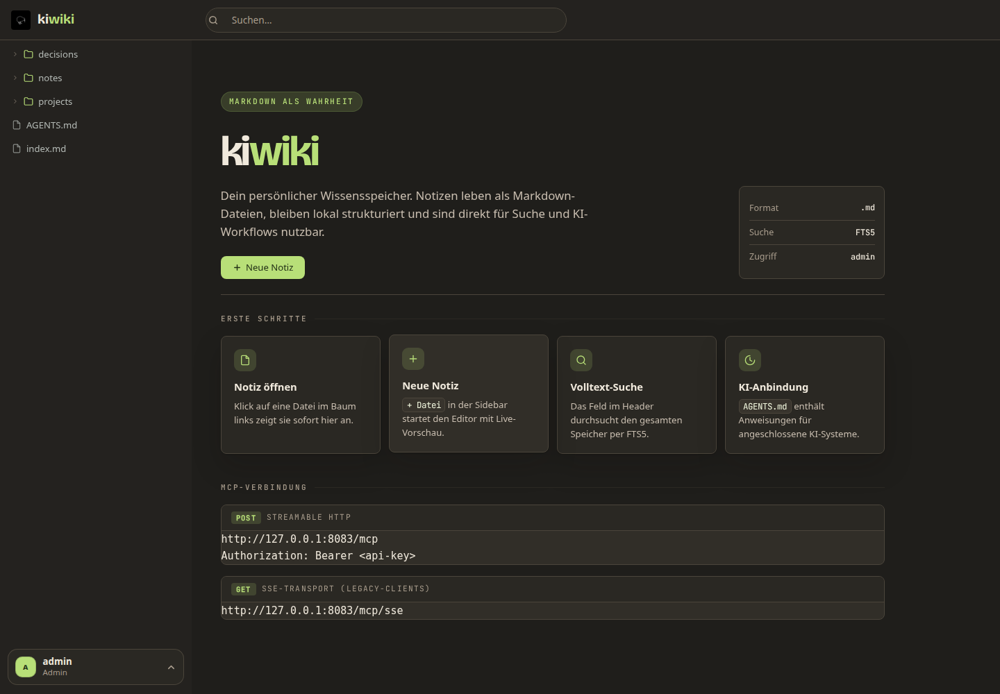
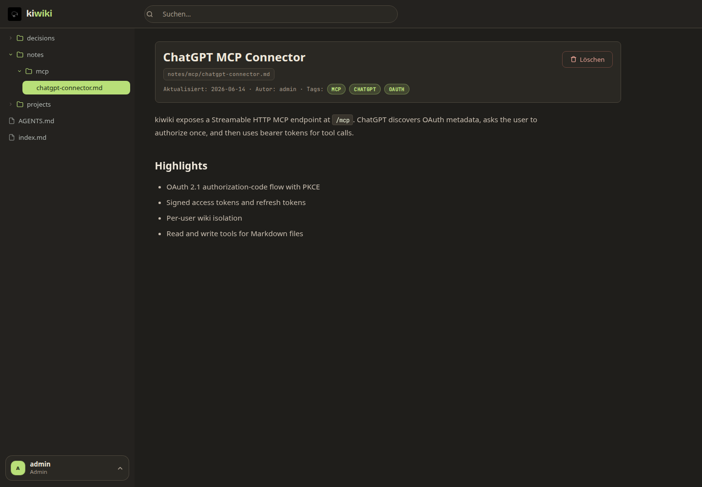
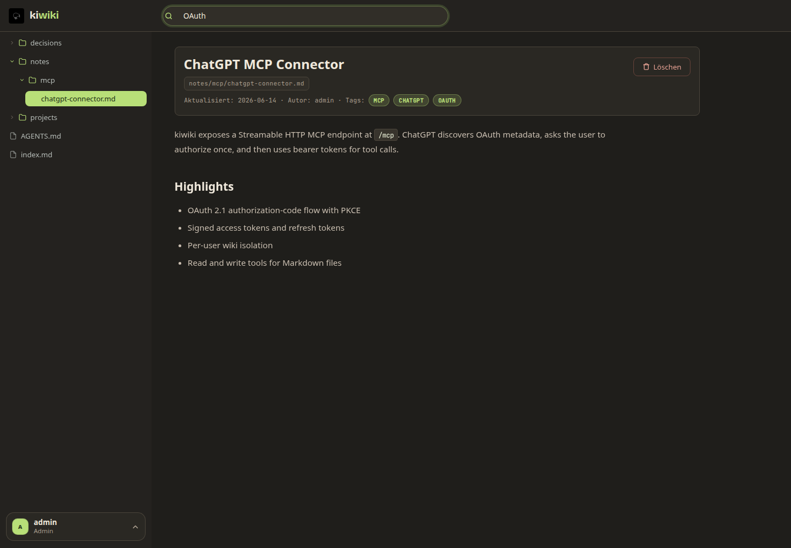
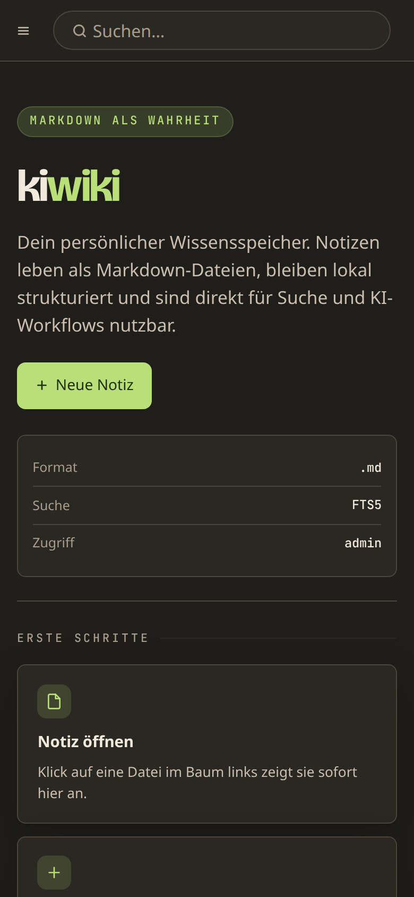

# kiwiki

[](https://kiwiki.xyz)


kiwiki is a self-hosted **Agent Harness** and Markdown knowledge base for humans and AI agents. Notes stay as regular files on disk, the web UI gives you a searchable wiki, and the built-in MCP server lets tools such as Claude Code, Codex, OpenCode, Cursor, ChatGPT, OpenClaw, Hermes, and any MCP client read and write the same knowledge base in parallel.

No hosted account is required. Your Markdown files are the source of truth.

Visit **[kiwiki.xyz](https://kiwiki.xyz)** for the project website, FAQ, agent integration guides, and hosting options.

## Screenshots







<p align="center">
  
</p>

## Features

- **Multi-Agent Harness** — Central knowledge base for Claude Code, Codex, OpenCode, Cursor, ChatGPT, OpenClaw, Hermes, and any MCP-compatible agent. All agents read and write the same wiki in parallel.
- **Markdown files with YAML frontmatter** — Your file system is the source of truth. No proprietary database, no vendor lock-in, simple to back up.
- **100 % privacy** — Self-hosted on your infrastructure. No cloud, no telemetry, no vendor lock-in.
- **Per-user isolated wiki folders** under `/data/<username>/` with role-based access (`read` / `write` / `admin`).
- **SQLite FTS5 full-text search** — Search thousands of Markdown files in milliseconds, including via MCP from your AI.
- **Responsive web UI** — FastAPI with Jinja2, HTMX, and Toast UI Editor. Works from 4K desktop to mobile.
- **Streamable HTTP MCP endpoint** at `/mcp` (legacy HTTP/SSE at `/mcp/sse`) with OAuth 2.1 authorization-code flow for ChatGPT-style connectors.
- **Docker Compose and Helm** — One command to start. Kubernetes-ready.

## Quick Start

```bash
git clone https://github.com/natorus87/kiwiki.git
cd kiwiki
cp .env.example .env
docker compose up -d
```

Open the web UI:

```text
http://localhost:8082
```

Use the API key configured in `KIWIKI_USERS`.

## Configuration

All runtime configuration is done through environment variables.

| Variable | Default | Description |
|---|---:|---|
| `KIWIKI_DATA_DIR` | `/data` | Data directory for all wiki files |
| `KIWIKI_USERS` | required | Built-in users in `user:key:role` format, comma-separated |
| `KIWIKI_BASE_URL` | `http://localhost:8080` | Public base URL used in MCP and OAuth metadata |
| `KIWIKI_LOG_LEVEL` | `INFO` | Python log level |
| `KIWIKI_TRUST_PROXY` | `true` | Use secure cookies behind a TLS reverse proxy |
| `KIWIKI_CORS_ORIGINS` | `*` | Comma-separated list of allowed CORS origins |
| `KIWIKI_RATE_LIMIT_ENABLED` | `true` | Enables login, read, and write rate limits |
| `KIWIKI_OAUTH_TOKEN_SECRET` | derived | Optional stable secret for signing OAuth MCP tokens |
| `KIWIKI_OAUTH_TOKEN_TTL_SECONDS` | `86400` | OAuth access-token lifetime |
| `KIWIKI_OAUTH_REFRESH_TOKEN_TTL_SECONDS` | `2592000` | OAuth refresh-token lifetime |

Example:

```env
KIWIKI_DATA_DIR=/data
KIWIKI_USERS=admin:<admin-api-key>:admin,writer:<writer-api-key>:write,reader:<reader-api-key>:read
KIWIKI_BASE_URL=https://kiwiki.example.com
KIWIKI_TRUST_PROXY=true
KIWIKI_CORS_ORIGINS=https://kiwiki.example.com
KIWIKI_OAUTH_TOKEN_SECRET=<random-token-signing-secret>
```

Generate strong keys with:

```bash
openssl rand -hex 24
```

Do not commit real API keys, OAuth secrets, `.env` files, or local wiki data.

## User Model

Each user gets a separate wiki root:

```text
/data/admin/
/data/alice/
/data/bob/
```

Users cannot read or search another user's files. Web UI requests, REST API calls, search, and MCP tools all run in the authenticated user's namespace.

Roles:

| Role | Permissions |
|---|---|
| `read` | Read files and search |
| `write` | Read plus create, edit, move, and reindex |
| `admin` | Full access, including delete and user management |

## ChatGPT and MCP

kiwiki exposes MCP over Streamable HTTP:

```text
https://kiwiki.example.com/mcp
```

For ChatGPT custom connectors, configure the MCP endpoint as the connector URL. If OAuth is enabled, ChatGPT discovers:

```text
/.well-known/oauth-protected-resource/mcp
/.well-known/oauth-authorization-server/mcp
```

The OAuth flow uses:

- Authorization code with PKCE
- Signed access tokens
- Refresh tokens
- The `resource` parameter expected by MCP clients
- Client ID Metadata Document style client IDs used by ChatGPT

For public deployments, set a stable `KIWIKI_OAUTH_TOKEN_SECRET`. This keeps connector tokens valid across container restarts while still allowing API-key rotation to revoke access.

Direct bearer-token access is also supported:

```bash
curl https://kiwiki.example.com/mcp \
  -H "Authorization: Bearer <api-key>" \
  -H "Content-Type: application/json" \
  -d '{"jsonrpc":"2.0","id":1,"method":"tools/list","params":{}}'
```

## Usage as AI Memory

Configure your AI tools to use kiwiki as persistent memory. The following instruction works for ChatGPT (Custom Instructions → Personalization), Claude (Personalization), and coding agents:

> Use kiwiki as my persistent memory. When asked about projects, decisions, recurring topics, personal preferences, or work context, first briefly check kiwiki. Use existing notes as context.
>
> Save new important information in kiwiki when it might be useful later: preferences, decisions, project knowledge, workflows, important facts, and open items. Prefer to update existing files rather than creating new ones. Organize according to the existing structure: `/projects`, `/decisions`, `/notes`, `/shared` and `/user`. Write short Markdown notes with frontmatter. Do not delete anything without explicit instruction. Also ask in longer chats whether you should save something.

For coding agents (Claude Code, Codex, OpenCode, Cursor), add this instruction to your project's `AGENTS.md`, `CLAUDE.md`, or equivalent configuration file.

### Agent Harness Setup

When using kiwiki as the Agent Harness for your project, instruct coding agents to connect to kiwiki via MCP. Add the following block to your project's `AGENTS.md` or `CLAUDE.md`:

> This project uses **kiwiki** as its Agent Harness and persistent memory.
>
> **MCP connection** — Connect to the kiwiki MCP server using the appropriate command for your tool:
> - Claude Code: `claude mcp add kiwiki http://localhost:8082/mcp --header "Authorization: Bearer <api-key>"`
> - Codex: `codex mcp add kiwiki http://localhost:8082/mcp --header "Authorization: Bearer <api-key>"`
> - OpenCode: configure MCP server in opencode.json
> - Cursor: configure MCP server in `.cursor/mcp.json`
>
> Once connected, use kiwiki as persistent memory (see usage instruction above).

This ensures every coding agent working on the project automatically connects to the shared knowledge base.

## MCP Tools

The MCP server exposes tools for common wiki workflows, grouped by required role:

### Read (any role)

`read_file` · `read_many` · `read_lines` · `fetch` · `search` · `grep` · `find` · `list_files` · `list_all_files` · `file_info` · `read_index` · `recent_files` · `backlinks` · `related_files` · `search_status` · `whoami`

### Write (write role or admin)

`write_file` · `edit` · `append_file` · `create_note` · `upsert_note` · `update_frontmatter` · `preview_edit` · `replace_many` · `build_index` · `reindex_all` · `tag_index` · `move_file`

### Admin (admin role only)

`validate_wiki` · `delete_file` · `sort`

## Local Development

Create a virtual environment and install dependencies:

```bash
python3.12 -m venv .venv
. .venv/bin/activate
python -m pip install -r requirements-dev.txt
npm ci
```

Run the app:

```bash
KIWIKI_DATA_DIR=./data \
KIWIKI_USERS="admin:dev-key:admin" \
KIWIKI_BASE_URL="http://127.0.0.1:8080" \
KIWIKI_TRUST_PROXY=false \
uvicorn app.main:app --host 127.0.0.1 --port 8080 --reload
```

Build the frontend motion bundle:

```bash
npm run build:motion
```

Run checks:

```bash
ruff check app tests
pytest -q
npm audit --audit-level=high
docker build -t kiwiki:test .
```

## Docker

The default Compose file builds the local image and serves the app on port `8082`:

```bash
docker compose up -d
docker compose logs -f kiwiki
```

Persistent data is mounted at:

```text
./data:/data
```

For public deployments, move real secrets into `.env` or your secret manager.

## Helm

A Helm chart is available under `charts/kiwiki`.

Install example:

```bash
helm upgrade --install kiwiki ./charts/kiwiki \
  --set env.KIWIKI_USERS="admin:<admin-api-key>:admin" \
  --set env.KIWIKI_BASE_URL="https://kiwiki.example.com" \
  --set env.KIWIKI_OAUTH_TOKEN_SECRET="<random-token-signing-secret>"
```

Review `charts/kiwiki/values.yaml` before deploying to production.

## Repository Hygiene

The repository includes:

- GitHub Actions CI for Ruff, Pytest, frontend build, and Docker build
- Dependabot configuration for Python, npm, and GitHub Actions
- Issue and pull request templates
- Security policy
- MIT license

Ignored local artifacts include `.venv/`, `node_modules/`, `data/`, Python caches, test caches, and local agent configuration.

## Security

See [SECURITY.md](SECURITY.md).

Important operational rules:

- Use strong random API keys.
- Set `KIWIKI_TRUST_PROXY=true` behind HTTPS.
- Restrict `KIWIKI_CORS_ORIGINS` in production.
- Set `KIWIKI_OAUTH_TOKEN_SECRET` for public MCP/OAuth deployments.
- Do not publish local wiki data or deployment secrets.

## License

MIT. See [LICENSE](LICENSE).
